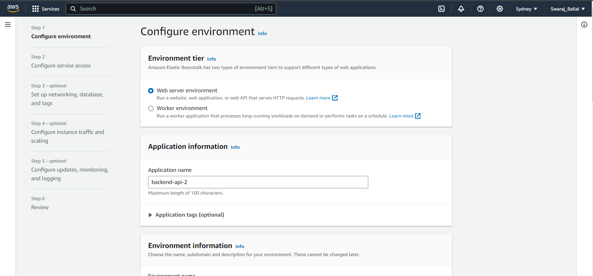
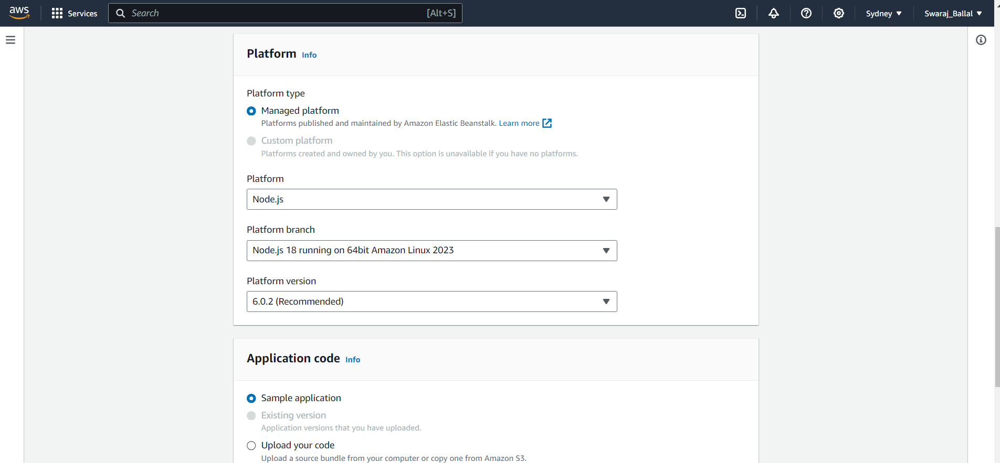
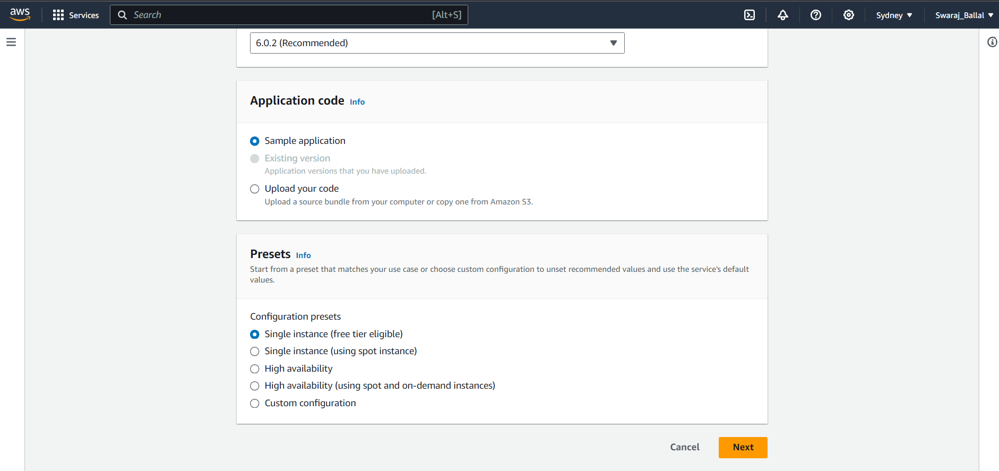
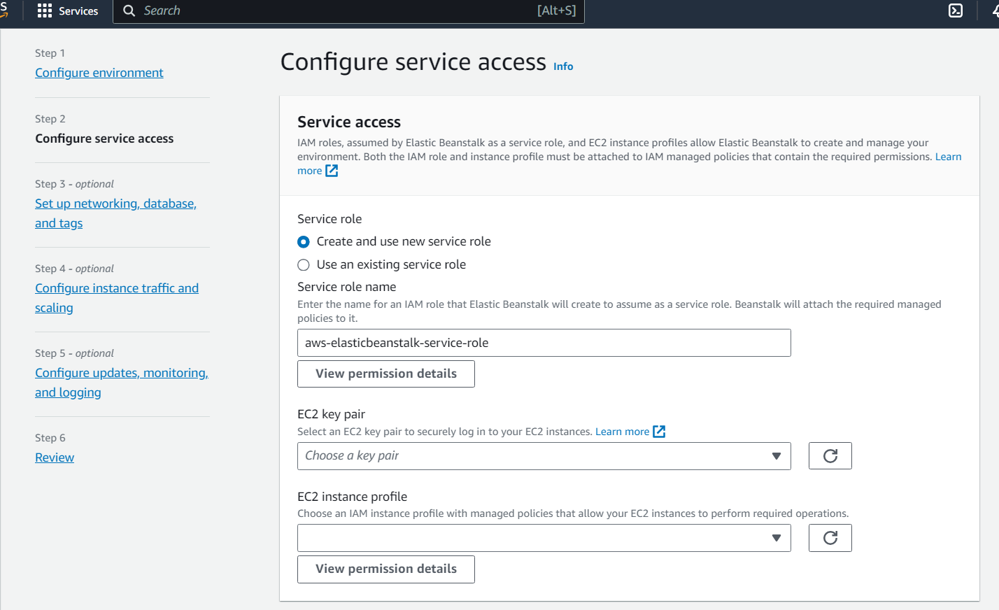
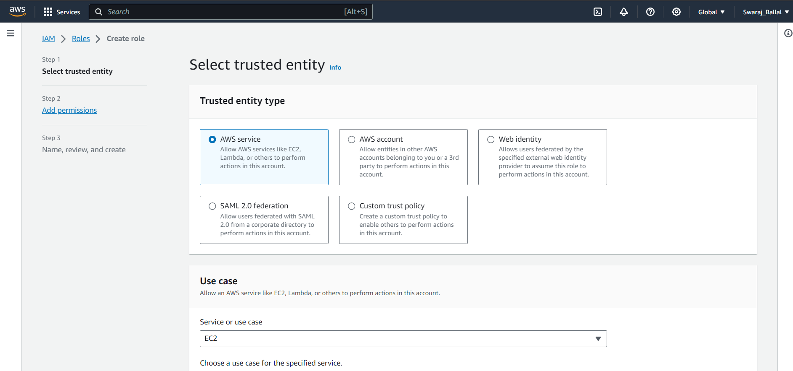
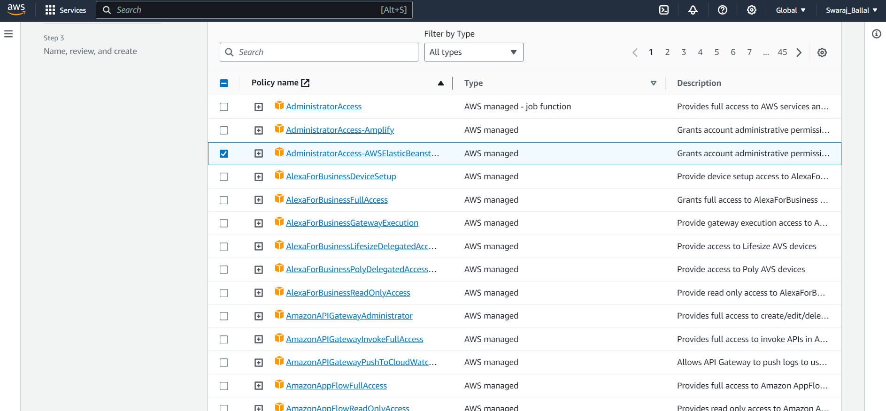
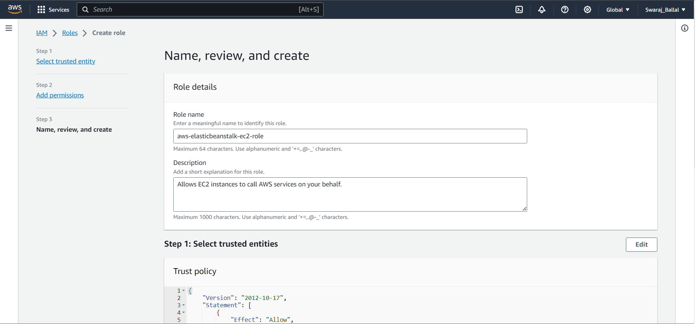
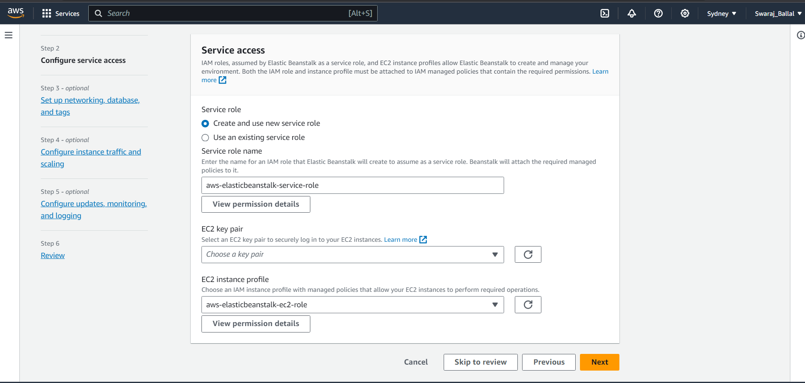
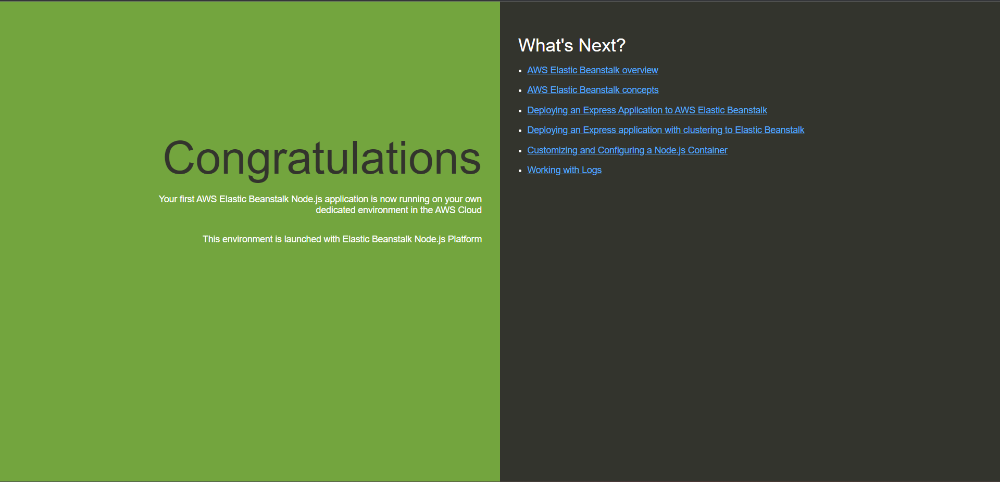
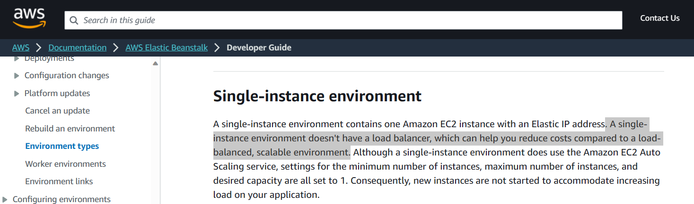

# Mastering-AutoScaling-and-Deployment-on-AWS-From-Cluster-Node.js-to-Golang-to-Auto-scaling-groups-Elastic-BeanStalk

## AutoScaling Backends

### Making Node Multi core
### Deploying to aws ec2 instances
### Golang vs Node.js
### Understanding images, launch templates and ASG.
### Elastic Beanstalk

0. Bare minimum way to deploy any production worthy app. </br>
1. Understanding autoscalling, why do you need it. </br>
2. Understanding load balancers (popular system design question) </br>
3. AWS way of doing LB/autoscaling. </br>
4. Understanding Backpacks deployment process. </br>

### Single threaded bs multi threaded languages

Node.js => single threaded </br>
Golang/Java => multi threaded

Node.js or Python are not thar powerful you cant use all the processing power of a machine. </br>

Golang/Java/Rust are multi threaded languages. </br>

Golang is better then node js first in terms of speed a for loop in golang is faster then a for loop in node js.
yes Bun has made node js  is faster but still bun isn't stable yet as of today october 2023. Golang also does multi threading by creating sub routines. Java/Rust lets you create new threads. we can distribute load in multi threaded language. </br>


#### Node js syncronous


it starts a request and then it waits for the response.then it starts another request and then it waits for the response. so and so forth its not starting multiple process parallely  </br>

Difference between syncronous and asyncronous is that let say a asyncronous database call is made then request from backend will go to database to fetch data by the time the data comes back to backend request node js will start another request till the time the data comes back from database. and will be done for subsequent request such that a single core or thread can handle multiple request without keeping thread ideal unlike synchronous nature where it waits for the request to come back and then process the next request. </br> </br>


Even though this is async code still we observe that one request is made it waits for the response to come back and doesn't start another request it is not behaving like async nature
because of how Browser sends request to backend. Chrome for example batches request and sends it to backend. so force request to send right we can use ab to send 1000 request from the terminal </br>

ab -n 1000 -c 16 http://localhost:3000/ </br>


here as you can see we passed many request at a time see below the request went and didnt wait for the response instead kept sending request and when later on recieved the response </br>


In golang subroutines are light weight version of threads much more easy to do context switching, context switch between subroutines is much more faster then context switch between threads. So in Golang you have to explicitly mention that start this in different sub routines only then golang starts it into new thread</br> 

So whenever a request comes it starts in a different go subroutine, so starting in new subroutine the maintainer of the http wrote that logic.

Syntax to start a new sub routine in golang is </br>

```go

go funcName()

go func() {
    // Your code here
}()

```
<br/>


In go we can see that all the request are being processed parallely in multi cores. </br>

using ab we see all the cores are being used at 100%. it distributes load across all cores </br>


### Can we do same in node js ? can we spawn multiple threads in node js handle multiple request/parallel execution ?

This can be done using cluster module in node js. </br>

How does cluster module works ? </br>

Let say we execute a node js file ther very first time we execute it. Cluster.Master will be true because we started executing the file. but we also get no of cpu's count or cores in the first run const cpuCount = os.cpus().length; so the rest of the cores/cpu's in cpu's count will be started as cluster.fork() basically new processes will be started and for them cluster.isMaster will be false. So parent cluster will just fork child clusters and child clusters will be the one executing the express servers. If child dies you can restart the processes or kill whole processes do health check etc. so here after the first time if condition won't be executed only else will be executed by child processes.</br>


```javascript

import cluster from "cluster";
import os from "os";
import { app } from "./express-app";

const port = 3000;

const cpuCount = os.cpus().length;

if (cluster.isMaster) {
  // Create a worker for each CPU
  for (let i = 0; i < cpuCount; i++) {
    cluster.fork();
  }
} else {
  app.listen(port, () => {
    console.log("listening on port 3000");
  });
}

```

Since there are 8 cores in my machine so 8 child processes are started. </br>


After passing requests using ab we see that all the cores are being used at 100% by a node js process </br>


### What is Autoscaling ?

Creating a AWS Instance as a construct which we can start and stop to do autoscaling mostly it is done by kubernetes or container orchestration 

### Interview Question
How is Kubernetes different from Vanilla autoscaling ? </br>
 Kubernetes(alreay have a cluster of pods which you turn on off) there is more like a incremental upgradation of pods.so you dont notice a sudden spike its when 20%-50% of the traffic is increased then you increase the pods by 20% or 50% and then you decrease the pods by 20% or 50% when the traffic is decreased. so it is more like a gradual increase and decrease of pods.Whereas the vanila autoscalling (increasing and decreasing EC2 instances on demand) is more like a sudden spike in traffic and then you increase the number of EC2 instances and then when the traffic is decreased you decrease the EC2 instances.So if you have multiple processes its better to use kubernetes and if you have single process then you can use vanilla autoscaling.so a kubernetes cluster have many pods so one pod can run db one can run backend and so on and so forth and communicate using ingress. 

 ### Vanilla Autoscaling using ASG (Auto Scaling Group) in AWS

Hotstar also uses ASG.

##### Deploying to aws 

1. EC2 Machines
2. images
3. Launch templates
4. target groups
5. ASG
6. Elastic 
 
Lets say you create an EC2 instance and you instll node , nvm, npm and clone your code build it to create a dist folder and you create image using image and templates --> create image/clone of machine allocate space to it 8GB default so you can run start or pm2 start on that image/machine so to do this we use launch templates (template to launch more instances). Give name to image in Application and OS images you surf through aws marketplace to find the image you want to use like nginx etc. since we created our own image we will go to
My AMI's and seleect owned by me and select the image we created. its becomes tough to say when the instance starts also run the pm2 command and here docker is easy to use. AWS does provides a way to run a command when the instance starts so select a machine then
a key-pair to ssh into individual machines select a security group you created if you want your final instances to keep port 3000 open , they don't have to but if you want to do it. Usually there is a loadbalancer in between, client hits the loadbalancer which exposes the port 3000 so that cleint dont hit backend servers directly they go through loadbalancer as it should be client should not directly go to backendserver so loadbalancer should have access to backend servers, load balancer ideally should be internet facing and backends should not be internet facing only to debug at first you can give internet access using security groups to find the right one go to you instance then security groups then in launch vizard you will see the security group you created. after this go to advance detail section so user data is the place where you write the command you want to run as soon as images are created or instances are created. now this user-data dont have access to node , npm, pm2 etc so you can't directly put the command to run the server. you have to explicitly mention the path to node, npm, pm2 etc. because they don't know what pm2 , node resolve to they dont have that path. so you have to write binary something like :

```bash
#!/bin/bash
export PATH=$PATH:/home/ubuntu/.nvm/versions/node/v20.9.0/bin
PM2=/home/ubuntu/.nvm/versions/node/v20.9.0/lib/node_modules/pm2/bin/pm2   // put PM2 in path
export PM2_HOME="/home/ubuntu/.pm2"
su-ubuntu -c "cd /home/ubuntu/week-20/part-4-multi-core:             // super user as ubuntu and then run cd command
nodejs/;PATH=$PATH; PM2_HOME=$PM2_HOME $PM2 start npm -- start-u ubuntu"    // ';'for telling the next command and also put the whole Path(from above) in PATH variable(in this line Path)  here PM2_HOME(this is the environment variable pm2 uses incase it is not abel to find its config)=$PM2_HOME(where the config is present as see above PM2_HOME which has the path for pm2) here $PM2(points to exact path of pm2 in  second line above) start npm -- start-u ubuntu(command to start it)
// 'or'
/home/ubuntu/.nvm/versions/node/v20.9.0/bin index.js     //complete path of binary and then index.js
```
Why do we need launch template? when we have a image already because maybe we want each image with different security groups or different commands to run so we need a template to launch instances where we can specify the image, security groups, user-data etc according to our needs. image is just a snapshot while template is similar to image and more information then a image</br>
if you start instances delete the first instance or it will be a additional instance running so if you start 10 instance from a template so in total there will be 11. </br>
we can also write these things in deploy.sh file and then run the file in user-data. </br>
after ssh into ec2 instance run the command which node to see the path to node binary.  </br>
So the above method is good but docker makes it easy to do this. this is for raw node js/go lang/ java </br>
Now our launch template is ready. to launch it you can go to launch template dashboard click on instance abd then actions and laun ch instance from template also specify the number of instances you want to start</br>
Now we need a construct who can start and stop instances on demand.</br>

### ASG (Auto Scaling Group)

ASG takes template as an input and gives you simple constructs. We can take the launch template and directly go to an auto scaling group but since our app has a loadbalancer it is a internet facing application if there was application where users dont hit the loadbalancer directly then we can go to ASG directly. For example a transcoder for video doesn't have to go to loadbalancer since it is not internet facing. Also if we directly create a ASG during the process of setup it will ask if your app is internet facing or not but since out app is on port 3000 and not on port 80 it might run into issues if we dont create target group first. 
lets try creating a ASG directly and this should be the last step if we are using a non internet facing app. Give auto scaling group name select the launch template or base image. as you app grows you might add different technology so then you will go back to your launch template and modify the current template and change to new image you might add git pull command in user-data but if image completely changes then you will create new instance create new image modify the launch template and in modify group select the new version of launch template. first time default version is 1. in availability zones and subnet select the sub nets across which you want to distribute the load you can select multiple regions. next will be configure advance options that will have load balancing since we need one we will select Attach a new load balancer. </br>
AWS has two types of Load Balancers one is at network layer and one is at application layer. Network layer to handle TCP,UDP.TLS etc and application layer to handle HTTP,HTTPS etc. since our app has http request we need application layer load balancer. Load balancer could be internal or internet facing. internal load balancer is used when you have an application that should be used by another AWS application of yours. Internet facing load balancer is used when you have a application that should be used by the internet. Protocol is HTTP and port is 80. since our application is on port 3000 but we can't do this because if we do that load balancer will start listening on port 3000 but Users will hit the port 80 of URL and not port 3000 hence we should have first created a target group. then default routing (forward to) will complain and here you have to select the target group or create a new one but it won't have the right port 
Last thing is Configure group size and scaling policies here you give a desired capacity, minimum capacity and maximum capacity or you can select Scaling policies which lets AWS decide or control the desired capacity, minimum capacity and maximum capacity according to the average CPU utilization here we can set average CPU utilization target value like 50. so if the average CPU utilization is 50% then it will increase the number of instances and if the average CPU utilization is 50% then it will decrease the number of instances. after few next clicks to see if you want to add tags like if instance go up if you want to listen to it etc you check instance management in auto scaling group if a new instance is started and main ec2 dashboard to see other ec2 instance with the new one we can delete the old one not needed.  
</br>


So Steps that we did to deploy our app to AWS </br>
1. EC2 Instance </br>
2. Image </br>
3. Launch Template </br>
4. Auto Scaling Group with target group and internet facing load balancer </br>

This is enough to deploy a app to AWS. This is good method for non internet facing applications through which you can control the workers like Leetcode where if there are many request you want to increase the number of workers and if there are less request you want to decrease the number of workers. so this good for offline since desired capacity, minimum capacity, maximum capacity can be controlled programitcaly is a good use case</br>

Problems: Since we gave the Port 3000 during creation of Load Balancer let it automatically select it the http port that will be exposed to user was set to be 3000 but we want it to be 80. so here target group acts like a listner so whenever a request comes to port 300 forward it to target group which has multiple EC2 instances. hence we should have created target group first on our own and not just go with ASG process directly. So any request that comes to load balancer forward it to registered target group you can see this in target group dashboard. Target groups also checks health of the instances and only forward request to healthy instances. </br>
How does it check health of instances ? </br>
There is a health check section, where it send a http request at the path at port 80 with some timeout of 5 seconds and if it gets a 200 response it will consider it healthy. else it will consider it unhealthy. </br>
We will also get unhealthy using above since the port it is hitting is 80 and not 3000 and we have set the port to 3000 in our app so change to port 3000 in health check. 

### How to minimize this Complex process ?
Elastic Beanstalk is a service provided by AWS which does all this for you. </br>
Elastic Beanstalk under the hood uses ASG, ASG under the hood uses launch template, launch template under the hood uses image and image under the hood uses EC2 instance. </br>

To debug EWS we use logs on Logs stash, loki, data dog etc to aggregate logs for multiple instances. </br>
There is not point of doing clustering in next js since it does edge caching which puts app in multiple locations. </br>

Try to scale horizontally as much as possible. that means more number of smaller machines. instead of less number of bigger machines. for cost efficency also </br>

### Elastic Beanstalk using non CI/CD method

  1. Create environment 
  2. Environment Tier
     a. Web server environment : If you are running a http server </br>
     b. Worker environment : anything that does not need to exposed on the internet (video transcoder etc) </br>

We will go with web server environment. </br>
  3. Application name
  4. Application code
     a. Upload your code </br>
     b. Upload your code from s3 </br>
     c. Sample application </br>



</br>
We can directly upload our Node js code, as of now will select sample application. </br>

  5. Presets
     configuration presets  </br>
     a. Single instances (free tier) </br>
there are many more select according to use case and on demand.  </br>
  6. Platform tyoe
     a. Platform: Node js or any according to your requirement </br>
     b. Platform branch: 18 on 64bit amazon Linux 2023  default</br>
     c. Platform version: 6.0.2  default</br>

  
  </br>

  
  </br>
  Click on Next </br></br>
  7. Configure service access : here you add additional info like key-pair do you want to ssh into this machines in EC2 key pair
     here either you have an exsisting service role or you can create a new one. on new you will get aws-elasticbeanstalk-service-role</br>
     Same for EC2 instance profile either you have exsisting one else you have to create a new one</br></br>
     Steps to create a new one :</br></br>
     
     </br></br>
     1. Go to IAM dashboard and In the navigation pane, choose Roles, then select Create role. </br>
     2. Under Select type of trusted entity, choose AWS service. </br>
     3. In the list of services, choose EC2, and then choose Next: Permissions. </br>

    </br></br>
     4. On the Attach permissions policies page, select the policy that grants the permissions that you want to delegate to the EC2 instances, and then choose Next: Tags. here i jsut want elastic beanstalk permisison administrator level you can choose according your requirement.</br>
   
  
     5. Give a name to the role and click on create role. </br>
  
     </br></br>
  8. Now you will have an exsisiting service role and EC2 instance profile. </br>

  

  9. rest setting like Set up networking, database, and tags you can set it up but for a simple node js app can keep default. even for complex apps even Configure instance traffic and scaling and Configure updates, monitoring, and logging can be kept default they mean what to happen when should instance increase or decrease other logics any which ways auto scalling will tweak these parameter according to load but if you want to tell it upfront feel free to do so. </br>
   
  10.  Review it and click on create submit. </br>

  In your EC2 dashboard you will see a new instance running and also in auto scaling group you will see a new group created. so all manual work of manual ASG donw using Elastic beanstalk you can go to elastic beanstalk dashboard see an instance and there is a internet facing url created and when you click on it you will see the same application of node js successfully created since we used sample application during process and didn't upload our own code you can do that too even the dashboard of elasticbean has an option to upload code directly by just uploading your desired folder but not the rigth way you should do it using CI/CD Pipeline.</br>
  Things to remember while directly uploading: </br>
    1. Elastic beanStalk in case of Golang you need to give just the binary. </br>
    2. Incase of Docker just the Dokcerfile. </br>
    3. Incase of typescript Node js it expects you to convert it into typescript to javascript and  it will run the command like npm run start or node dist/index.js it doesn't understand typescript so even in CI/CD we have to first build the project and only upload js code. it expects you to upload a zip file
    4. Don't just got to folder right click and compress archive or zip that is wrong because elastic beanstalk will unarchive or unzip it and will try to find dist folder but it won't be able to do so because after unzip it will see the same folder name again and in that folder is dist so instead the correct way is to go into the folder select all the files CTRL+A dist etc folder and then compress so that when elastic bean unzips it it will get access to files this time and not a folder with project name. the reason why this happens because elastic bean searches for a standard files in the project like in node js it looks for app.js file, index.js file, build/index.js file, build/app.js file, dist/index.js file and dist/app.js file so after compressing you can upload the zip file.</br>
    5. How would it know which port to run in on ? </br>
       Elastic bean stalk gives you a port as an environment variable. also they have a deafult port 5000. so you can in your code change you port to 5000 and listen on 5000 else you can edit this default port in elasticbeankstalk dashboard under configuration next to go to environment. const PORT = process.env.PORT || 5000 </br> 
  </br>
 </br>
if you are using single instance environment you won't see a load balancer </br></br>

Apart from this you can also use fly.io and render.com to deploy your app. </br>

## Elastic Beanstalk using CI/CD method

Docker is the best way to deploy your app to AWS even on Elastic Beanstalk avoid using raw node js or other since maybe you don't want to use this in future instead you decide to shift docker needs docker image to build and image that is more easy to containerize and push images. so always containerize it and then select docker and deploy using docker to elastic bean stalk there would be a extra step you hvae to first build and the image and push the docker image somewhere and pull image on elastic beanstalk and redeplot to elasticbeanstalk</br>

### Non containerized CI/CD elastic beanstalk 

```yaml

name: Deploy backend-api
on:
  push:               
    branches:
      - master         // any time a push on master branch 
      
jobs:
  deploy: 
    runs-on: ubuntu-latest         // deploy on an ubuntu machine
    steps:
      - uses: actions/checkout@v2   // first checkout the code

      - name: Create zip
        run: "cd part-5-multi-core-eb && npm install && npm run build && zip -r deploy.zip *"     // create a zip of proj named deploy.zip
 
      - name: Deploy to EB
        uses: einaregilsson/beanstalk-deploy@v20    // deploy to elastic bean stalk aws commands are pre written by someone else we just need to put our own secrets that are AWS_EB_ACCESS_KEY_ID and AWS_EB_SECRET_ACCESS_KEY below
        with:
          aws_access_key: ${{ secrets.AWS_EB_ACCESS_KEY_ID }}    // secrets are stored in github secrets
          aws_secret_key: ${{ secrets.AWS_EB_SECRET_ACCESS_KEY }}  // secrets are stored in github secrets
          application_name: backend-api   // it also needs name of application that has to be deployed
          environment_name: backend-api-env   // the environment name in which you want to redeploy on.
          version_label: ${{ github.sha }}   // we deploy code manually in elastic bean stalk so we need to give a version label so that we can track which version is deployed which is the sha or hash for the commit we have
          region: us-west-1   // region in which you want to deploy
          deployment_package: ./part-5-multi-core-eb/deploy.zip   // this is important the package or zip that it will deploy to elastic bean stalk

```

To get these AWS_EB_ACCESS_KEY_ID and AWS_EB_SECRET_ACCESS_KEY you have to go to your account and create a scoped accesss key and secret key for elastic bean stalk , here scoped means it will only have access to elastic bean stalk and not other services. </br>


## Serverless Architecture

AWS,GCP etc provides serverless architecture. Which means you have to give them the code they will do the rest configuration, scaling which server's to use etc. They charge on per request basis unlike instances where you have to pay for the whole instances on a monthly basis. Its initially free and good for student projects since we don't get much traffic and when no traffic is there we don't have to pay anything and its turn on and off on demand so pay only on demand/request basis. </br>

### Problems with serverless architecture
1. Price scales very much when traffic increases after a certain point. It would be better to pay for 3 instances instead of paying for 30000/seconds requests so eventually companies shifts to server architecture </br>
2. Cold starts: If no one is hitting you serverless function for a long time then it will go to sleep and when someone hits it again it will take time to wake up and then respond to the request. </br>

### Interview Question

How to solve cold start problem in serverless architecture ? </br>
1. Maintaining a warm server swarms atleast keep a small server always running charges around 20$ per month. </br>
2. Keep pinging the server every 5 minutes so that it doesn't go to sleep.(Ugly way) </br>
   New relic or Data dog can be used to ping the server. </br>

AWS has a service called lambda which is serverless architecture. </br>
Cloudflare has a service called workers which is serverless architecture also provides DDOS(Denial of service)(when bots start spaming) attacks and provides protection they too do edge caching like if i hit from a india they will send cached data from india same for other countries. they provide a CLI to interact with it called wrangler </br>
GCP has a service called Firebase functions which is serverless architecture. </br>

Serverless are not just for compute but also for database(serverless database), storage etc. </br>
Serverless means you don't have to manage the server its the responsibility of the cloud provider hence serverless but always there is a server created for incoming requests </br>

Very basic usage should be done using serverless architecture. </br>

Steps to create worker using cloudflare and wrangler CLI </br>
https://developers.cloudflare.com/workers/

1. npx wrangler init app-name </br>
It doesn't use express hence it has fetch handler and Scheduled handler. fetch is the simplest one a backend server
it can also write test, typescript, package.json, cd into folder and run npm run start you can use hono which is similar to express and cleaner then the default one so use hono</br>
2. To deploy use wrangler login </br>
3. npm run deploy </br>

Use itty-router for routing in cloudflare workers. </br>

Websocket should not be used in serverless architecture. since it needs a persistent connection and serverless architecture is not meant for that it randomly shuts and starts instanceson demand </br>
